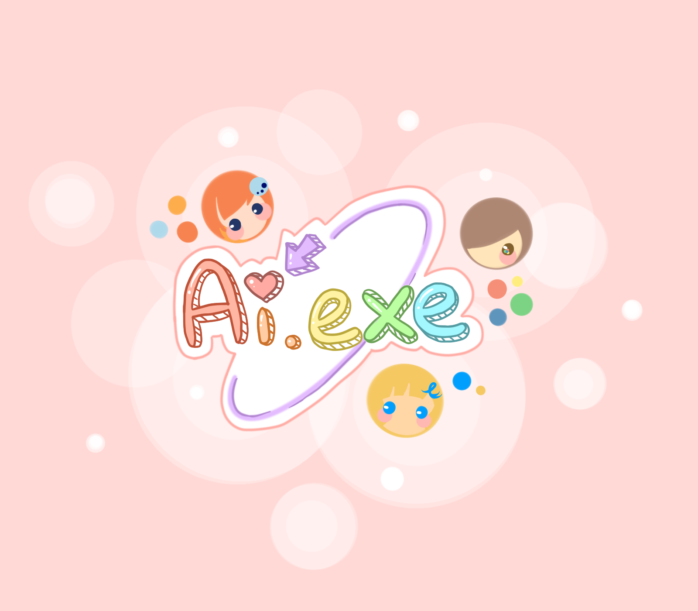
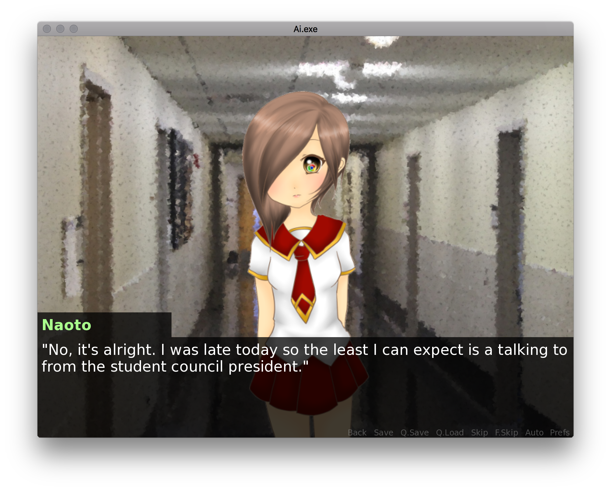

# Ai.exe
### A browser love story

Ai.exe is a visual novel based on the premise of internt browsers. You play Takamura Naoto, a freshman in high school who has pretty anti-social tendencies. One day his computer breaks, which drives him to start attending his classes. As he starts going to class, he encounters three different girls, Kuromi, Elsie, and Mosaic.

From left to right: Kuromi (Chrome), Elsie (Internet Explorer), and Mosaic (Mozilla Firefox)

As Naoto begins to live his daily high school life he will find himself dragged towards one of the girls and his heart will begin to blossom.

## To Play
To play the game, download the zip files from the [Releases tab](https://github.com/LinkCable/Ai.exe/releases)

## How It Was Made
Ai.exe was made in Renpy, with art contributed by my wonderful friend [Roslyn](https://www.instagram.com/shi__r0/).

## Gameplay

